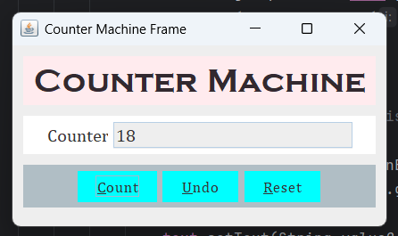

# Counter Machine

## 📝 Summary

This is a simple **Counter Machine** built with **Java Swing**. It provides basic functionality to count up, count down, and reset a counter with a graphical user interface. The application features easy-to-use buttons for incrementing, decrementing, and resetting the counter value.

---

## ⭐ Features

- **Count**: Increments the counter by 1 each time the "Count" button is pressed.
- **Undo**: Decrements the counter by 1 if the value is greater than 0.
- **Reset**: Resets the counter back to 0.
- Clean and intuitive GUI with easy-to-read labels and buttons.
- Keyboard shortcuts for actions (`Alt + C` for Count, `Alt + U` for Undo, `Alt + R` for Reset).

---

## 🛠️ Technology Used

- **Java**: Programming language
- **Java Swing**: GUI library for building the user interface
- **Fonts**: Custom fonts for the interface styling

---

## 🖼️ Screenshot

## 👤 Author

**Md. Riad Hasan**  
BSCSE  
**Uttara University**

---

